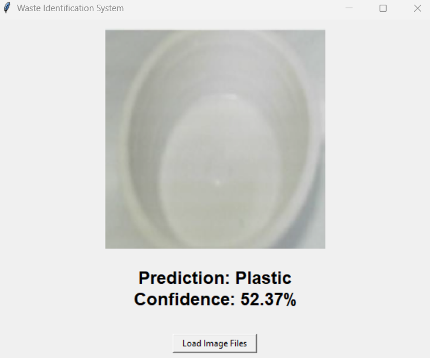
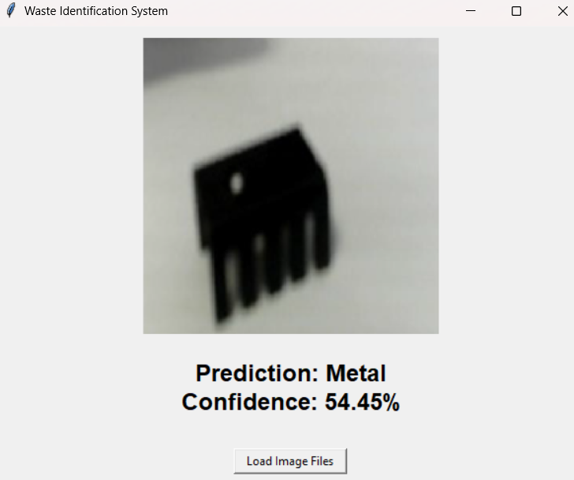
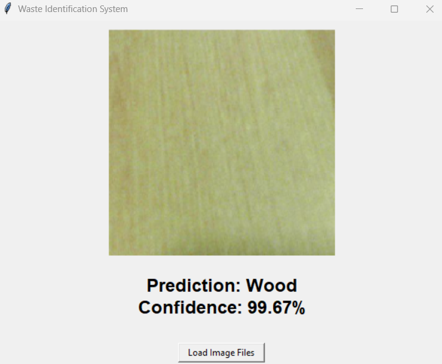

# Waste Identification System

The Waste Identification System is designed to classify plastic, metal, and wood waste materials with a confidence rating from uploaded image files.
It uses a waste identification model trained on over 2,000 images to detect different types of waste materials and provide a confidence score for each prediction.

Prediction result example
| Plastic | Metal | Wood |
|---------|---------|---------|
|  |  |  |